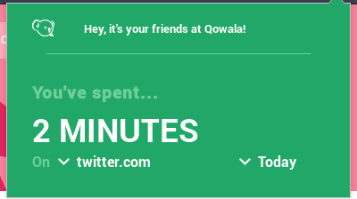

# Qowala Browser Plugin

Do you know you much time you spend on social networks? This plugin helps you to know.
Simply add the Qowala plugin to your browser and it will display the time you spent.

Available for [Firefox](https://addons.mozilla.org/en-us/firefox/addon/qowala/)

This plugin browser is part of the Qowala project which aims to help you have a better 2.0 life.
We think you should be able to master your tools and not be mastered by them. So, use social networks wisely and do not forget to get some fresh air!

## Contribute

You think some features should be added? You see some bug? Feel free to contribute!

### Implementing features and solving bugs

We advice you to use `web-ext` if you want to write some code. Install it with `npm install -g web-ext`.
Then, to test the extension with auto-reloading, run `web-ext run`.

## Contributors

- [KillianKemps](https://github.com/KillianKemps)
- [Bat41](https://github.com/Bat41)

## License

The Qowala Plugin is under the [CeCILL](LICENSE.md) Free Software License. It is compatible with the GPL License and takes into account the French Law.
