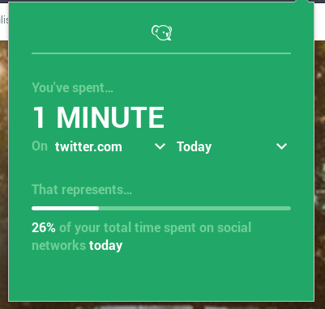

# Qowala Browser Plugin

Do you know how much time you spend on social networks? This plugin will help you to know.
Simply add the Qowala plugin to your browser and it will display the time you spent.

Available for [Firefox](https://addons.mozilla.org/en-us/firefox/addon/qowala/)
Available for [Chrome](https://chrome.google.com/webstore/detail/qowala/glkhfabbdeifnmjmflppepimimikgbog?hl=en-US)

This plugin browser is part of the Qowala project which aims to help you have a better 2.0 life.
We think you should be able to master your tools and not be mastered by them. So, use social networks wisely and do not forget to get some fresh air!

Open the extension's popup to see how much time you have spent on the current website. And switch between websites in the dropdown to compare.

If the default websites we added don't suits you, feel free to edit the websites to be tracked either with the module's popup or in the module's Preferences.

## Contribute

You think some features should be added? You see some bug? Feel free to contribute!

### Creating issues

If something is wrong or could be improved, let us know by creating
[a new issue](https://github.com/Qowala/browser-extension/issues/new). Be sure to clearly describe your
problem, and we will find a solution.

### Implementing features and solving bugs

If you know JavaScript, HTML or Sass (or both), you can also help by writing code.

First of all, fork this repository and `git clone` your fork on your machine. Then be sure you have
[yarn installed](https://yarnpkg.com/fr/docs/install/).

Then run `yarn` to install dependencies, create a new branch for your changes, and start coding!
Once you think your work is finished, push your changes and open a pull request. We will review it,
and merge it if there are no changes needed.

To test your changes, use `yarn run start`. A new Firefox window will open, with the extension loaded.

Also make sure to write tests if you implement new features, and to check everything works fine with `yarn run test`.

## Contributors

- [KillianKemps](https://github.com/KillianKemps)
- [Bat41](https://github.com/Bat41)

## License

The Qowala Plugin is under the [CeCILL](LICENSE.md) Free Software License. It is compatible with the GPL License and takes into account the French Law.
